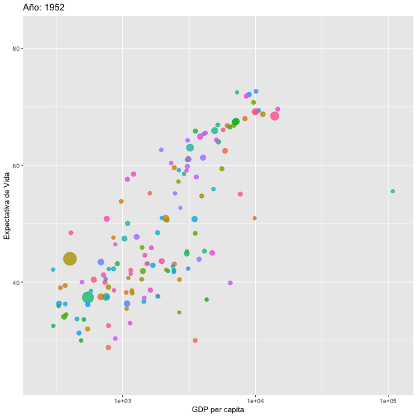

```{r setup, include=FALSE}
knitr::opts_chunk$set(echo = TRUE, warning=FALSE, message = FALSE)
```

```{r, eval=TRUE, echo=FALSE}
colorize <- function(x, color) {
  if (knitr::is_latex_output()) {
    sprintf("\\textcolor{%s}{%s}", color, x)
  } else if (knitr::is_html_output()) {
    sprintf("<span style='color: %s;'>%s</span>", color, 
      x)
  } else x
}

#`r colorize("some words in red", "red")`
```

```{r}
#if(!require(devtools)) install.packages("devtools")
#devtools::install_github("dgrtwo/gganimate")
#devtools::install_github("yihui/animation")
```


```{r}
library(tidyverse)
library(gganimate)
library(rgl)
library(gapminder)
library(ggplot2)
library(animation)
library(gt)
```


```{r}
# Load required package

```

Los datos provienen del paquete **gapminder** y el archivo **gapminder**. Estos datos representa la expectativa de supervivencia en diferentes 142 paises entre 1952 y 2007.  Aquí observamos las primeras 6 filas del archivo.  
```{r}
gt(head(gapminder))
```


Primero creamos un gráfico de puntos sin animación.  En el eje de **X** representa el GDP per capita en cada pais, y en el eje de **Y** la supervivencia.  El tamaño del unto es relativo el tamaño del pais. La escala en el eje de **X** fue cambiado a una logarítmica usando  **scale_x_log10()**.   


```{r}
p <- ggplot(
  gapminder, 
  aes(x = gdpPercap, y=lifeExp, size = pop, colour = country)) +
  geom_point(show.legend = FALSE, alpha = 0.7) +
  scale_color_viridis_d() +
  scale_size(range = c(2, 12)) +
  scale_x_log10() +
  labs(x = "GDP per capita", y = "Expectativa de Vida")
p
```

## Gráficos con animación:

Para incluir las transiciones en tiempo se usa la función **transition_time**.  El largo de transición sera corespondiente as la diferencia entre la variable de tiemo (en este casa "Time")


La variable **frame_time** añade arriba una leyenda del tiempo de transición. Note que se usa la función **labs** y se añade el titulo, lo que hay en los corchetes es el cambio en tiempo.   


```{r}
GDP_time=p + transition_time(year) +
  labs(title = "Año: {frame_time}")
#GDP_time

```

```{r}
animate(GDP_time, height = 600, width =600)
anim_save("GDP_time.gif")
```



## Crear facet animados.
Para crear un gráfico por grupo y observar el de patrones de cambio en tiempo por continente se añade **facet_wrap**.  Se añade esta función al  


```{r}
p + facet_wrap(~continent) +
  transition_time(year) +
  labs(title = "Año: {frame_time}")
```


## Animación de los ejes

En este caso lo que observamos es que la leyenda en en **x** varia con los años, y la de **y** la dejamos fija.  Si se usa **view_follow(fixed_x = TRUE)**, la leyenda en y variaria con el cambio en GDP per capita y la de **x** seria fija.  Si queremos que los dos ejes varian con los datos se usa **view_follow()**, sin poner nada dentro de los paréntesis.


```{r}
p + transition_time(year) +
  labs(title = "Año: {frame_time}") +
  view_follow(fixed_y = TRUE)
```

## Observar transiciones entre valores

La función **shadow_wake** es para representar un efecto de sobre o direccón por donde ocurre los cambios. Se puede selecionar el tamaño de la disminución y la opacidad de la sombra.  El largo de la cola no es 

`r colorize("Julián can you  translate this?", "red")`

The length of the wake is not given in absolute frames as that would make the animation susceptible to changes in the framerate. Instead it is given as a proportion of the total length of the animation.


```{r}
p + transition_time(year) +
  labs(title = "Year: {frame_time}") +
  shadow_wake(wake_length = 0.1, alpha = FALSE)
```


## Visualizar los datos originales en el fondo 


Con la función **shadow_mark** se puede ver los datos originals. Tanto los datos anteriores y futuros se pueden demostrar con diferentes estilos. Por ejemplo con el siguiente script **shadow_mark(past = FALSE, future = TRUE)** se observaría los datos futuros y no del pasado.  


```{r}
p + transition_time(year) +
  labs(title = "Year: {frame_time}") +
  shadow_mark(alpha = 0.3, size = 0.5)
```


## Transiciones graduales 

Con la función **transition_reveal** los datos aparece gradualmente en el gráfico

Usamos otro conjunto de datos del archivo **airquality** que se encuentra en el paquete **datasets**
Primero creamos un gráfico éstatico (sin animación), el dia del mes (day), la tempetaura del dia (Temp) y una linea para cada mes (mayo a septiembre) con la función **group**.  

```{r}
p <- ggplot(
  airquality,
  aes(Day, Temp, group = Month, color = factor(Month))
  ) +
  geom_line() +
  scale_color_viridis_d() +
  labs(x = "Day of Month", y = "Temperature") +
  theme(legend.position = "top")
p
```


Ahora animamos el gráfico en el eje de **x**


```{r}
p + transition_reveal(Day)
```

Se puede añadir un punto al principio de las lineas 

```{r}
cambio_m=p + 
  geom_point() +
  transition_reveal(Day)
```

```{r}
animate(cambio_m, height = 800, width =800)
anim_save("cambio_m.gif")
```


# Los puntos se pueden quedar en el gráfico con añadiendo **(group = seq_along(Day)**. 

```{r}
p + 
  geom_point(aes(group = seq_along(Day))) +
  transition_reveal(Day)
```


# Transition between several distinct stages of the data

Data preparation:

```{r}
library(dplyr)
mean.temp <- airquality %>%
  group_by(Month) %>%
  summarise(Temp = mean(Temp))
mean.temp
```


Create a bar plot of mean temperature:

```{r}
p <- ggplot(mean.temp, aes(Month, Temp, fill = Temp)) +
  geom_col() +
  scale_fill_distiller(palette = "Reds", direction = 1) +
  theme_minimal() +
  theme(
    panel.grid = element_blank(),
    panel.grid.major.y = element_line(color = "white"),
    panel.ontop = TRUE
  )
p
```

transition_states():

```{r}
p + transition_states(Month, wrap = FALSE) +
  shadow_mark()
```
enter_grow() + enter_fade()

```{r}
Month_trans= p + transition_states(Month, wrap = FALSE) +
  shadow_mark() +
  enter_grow() +
  enter_fade()

Month_trans
```
Save animation

If you need to save the animation for later use you can use the anim_save() function.

It works much like ggsave() from ggplot2 and automatically grabs the last rendered animation if you do not specify one directly.


```{r}
animate(Month_trans, height = 800, width =800)
anim_save("Month_trans.gif")
```


Para más ejemplos de como usar gganimate ves este enlace 
<https://semba-blog.netlify.com/10/29/2018/animating-oceanographic-data-in-r-with-ggplot2-and-gganimate/>


