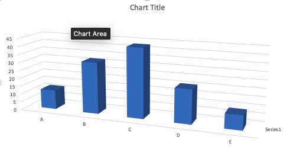

```{r setup, include=FALSE}
knitr::opts_chunk$set(echo = TRUE)
```


```{r include=FALSE, message=FALSE}
library(tidyverse)
library(gridExtra)
library(gt)
library(random)
library(ggplot2)
```

# Ejemplos de Gráficos problemáticos


## Errores típicos en la producción de gráficos. 

## Gráficos en 3D

Uno de los error principal cuando se hace gráficos es concentrarse en la decoración del gráfico para dar una impresión grandiosa y no en pasar un mensaje facil a la audiencia. Algunos de los errores incluye.  

 * Dimensiones innecesarias como los gráficos 3D para enseñar el conteo.  Este es un caso que uno ve regularmente en muchos sitios, artículos científicos, revistas y periódicos y trabajos de estudiantes.  **NO** hay ninguna razón de añadir una otra dimensión en la siguiente gráfica ya que no nos ayuda a entender los datos y hasta puede causar dificultad de entender cual son los valores reales que representa las barras.  Desafortunademente la facilidad de aplicar un gráfico en 3D en MS Excel por cualquier tipo de datos ha amplificado el mal uso de este tipo representación de datos.   
 
 En el gráfico abajo la tercera dimensión (3D) no aporta al entendimiento de los resultados.  Añadiendo al problema visualizando las barras el valor en el eje de "y" que representa la barra en 3D, es representado por el frente o detrás de la caja 3D.  Por consecuencia a añadir 3D en este caso es complicar el apreciación de los valores.  

 
```{r echo=FALSE, out.width = '50%', fig.align='center'}

```
 
 


## Errores de escala en los ejes

Muchas veces la variable en "X" tiene intervalos que no corresponde a la escala de la variable. En el siguiente ejemplo tenemos una linea que representa la cantidad de casos de una enfermedad, y el eje de "x" el año de recolección de los datos.  Nota que la escala no es consistente, hay 15 años entre 1930 y 1945, y 45 años entre los dos últimos intervalos. 


```{r echo=FALSE, out.width = '50%'}

x=c(1900, 1910, 1920, 1930, 1945, 1990)
y=c(110, 120, 140, 160, 200, 1000)
z=c("A","A","A","A","A","A")

df=tibble(x,y,z)


l1=ggplot(df, aes(as.factor(x),y,group = interaction(z,y)))+
  geom_point()+
  geom_path(group=1)+
  xlab("Años")+
  ylab("Números de casos")

```

En el siguiente gráfico se resuelve el problema dejando que la escala se ajuste a los intervalos correctos de años.  


```{r echo=FALSE, out.width = '50%'}

x=c(1900, 1910, 1920, 1930, 1945, 1990)
y=c(110, 120, 140, 160, 200, 1000)

df=tibble(x,y,z)


l2=ggplot(df, aes(x,y))+
  geom_point()+
  geom_path(group=1)+
  xlab("Años")+
  ylab("Números de casos")+
  scale_x_continuous(breaks=c(1900,1910, 1920, 1930, 1940, 1950, 1960, 1970, 1980,1990))

grid.arrange(l1,l2,ncol=1)
```

##  La cantidad de "ticks".

La cantidad de grupos en las escalas es frecuentemente un problema donde hay demasiado o no suficiente información para aclarar la escalas.  Vemos aquí dos ejemplos de estos problemas. En el primero no se puede leer con facilidad la secuencia de los datos en la variable "x". En el segundo gráfico no se enseña suficiente información. La escala y la información debería ser fácil de entender y representando las ideas que el científico quiere discutir. 


```{r include=FALSE}

y=rnorm(1000, 0,1)


x= seq(from = 0, to = 999, by = 1)
dfs=tibble(x, y)
number_ticks <- function(n) {function(limits) pretty(limits, n)}

a= ggplot(dfs, aes(x=x, y=y))+
  geom_point()+
  scale_x_continuous(breaks=number_ticks(40))+
  xlab("La secuencia de los valores")


b= ggplot(dfs, aes(x=x, y=y))+
  geom_point()+
  scale_x_continuous(breaks=number_ticks(3))+
  xlab("La secuencia de los valores")
```

```{r echo=FALSE}
grid.arrange(a,b,ncol=1)
```


## Problema de escala, incluir el cero o no?


En muchas ocasiones la falta de incluir una escala adecuada en la variable dependiente (Y) resulta en que es difícil interpretar los resultados.  Aquí van a observar dos gráficos, donde en la primera da impresión que hay diferencias entre los grupos (por ejemplo el grupo "D" tiene valores más pequeños, pero cuando se cambia de escala y se incluye el cero (en la segunda figura) con los mismo datos no se aprecia esta diferencia tan marcada. El único componente que se cambio fue la escala con los mismos datos. ¿Cúal es la escala correcta? Depende de los tipos de valores, y el mensaje que el investigador quiere transmitir. Por ejemplo si en realidad NUNCA es posible (o improbable) llegar al cero no seria correcto enseñar la escala de cero. Un ejemplo exagerado, si el grupo se mide la temperatura en la escala de Kelvin, y Ud demuestra en una figura la temperatura típica de un lugar, por ejemplo si el grupo "D" representa la ciudad de Paris, no seria lógico tener el eje de "y" que se extiende a 0° Kelvin ya que la temperatura de este lugar no puede llegar a esta temperatura, lo lógico seria de tener una escala que representa los valores mínimo y máximo en el periodo del estudio.        


```{r include=FALSE}
set.seed(78687957)
x=LETTERS[seq( from = 1, to = 10 )]
x
y=runif(10, 80,100)
y

dfY=tibble(x,y)

b= ggplot(dfY, aes(x,y))+
  geom_count()+
  theme(legend.position = "none")+
  xlab("Lugar")+
  ylab("Temperatura en K°")


c= ggplot(dfY, aes(x,y))+
  geom_count()+
  expand_limits(y = c(0, 100))+
  theme(legend.position = "none")+
  xlab("Lugar")+
  ylab("Temperatura en K°")
```

```{r echo=FALSE}

grid.arrange(b,c, nrow=1)
```


## Construcción de Tablas:

Aquí demuestro algunos errores comunes cuando se prepara tablas.  

  1. Errores comunes en tablas es incluir un exceso de valores significativos y en diferentes formato en la misma columna.
  2. Los valores numéricos no están justificado a la derecha. Es importante que los valores numéricos sean justificado a la derecha ya que nuestra apreciación de la diferencias numéricas van de derecho a izquierdo, y automáticamente un valor de 112 y más grande que un valor de tiene dos dígitos.    
  3. Las escala de los valores no están mencionados.
  
  Aquí presento dos tablas una con los errores y la segunda son estos errores corregidos. ¿Encuentra los errores?  
  
  
### Tabla con errores 
  
|         | Tamaño de muestra | El largo de la hoja | valor de p  |
|---------|:-------|:--------:|:-------------|
| Especie 1 | 27273 |  11.03  | 0.000000001 |
| Especie 2 | 169019 | 13.5  | 0.098979676 |
| Especie  | 1.087^6 | 14.5  | .0300001 |

***

### Tabla con errores solucionados

|         | Tamaño de muestra | El largo de la hoja (cm) | valor de p  |
|:---------|-------:|--------:|-------------:|
| Mujeres | 27273 | 11.0  | <0.001 |
| Hombres | 169019 | 13.5 | 0.099 |
| Especie  | 1087669 | 14.5  | 0.030 |