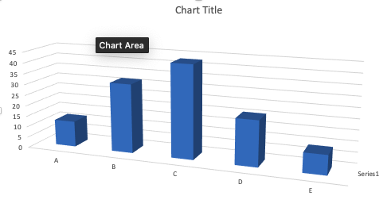

```{r setup, include=FALSE}
knitr::opts_chunk$set(echo = TRUE, fig.align='center')
```

```{r include=FALSE}
library(tidyverse)
library(gridExtra)
```


# ¿Que es visualizar datos?


# Ejemplos históricos


# Ejemplos de Gráficos horibles


# Errores típicos en la produccion de gráficos. 

# Gráficos en 3D

Uno de los error principal cuando se hace gráficos es concentrar se en la decoración del gráfico para dar una impresión grandiosa y no en pasar un mensaje a la audiencia. Algunos de los errores incluye

 * Dimensiones innecesarias como los gráficos 3D para enseñar el conteo.  Este es un caso que uno ve regularmente en muchos sitios, artículos científicos, revistas y periódicos y trabajos de estudiantes.  **NO** hay ninguna razón de añadir una otra dimensión en esta gráfica ya que no ayuda a entender los datos y hasta puede causar dificultad de entender cual son los valores reales que representa las barras.

 
```{r echo=FALSE, out.width = '50%', fig.align='center'}

```
 
 


# Errores de escala

Muchas veces la variable en "X" tiene intervalos que no corresponde a la escala de la variable. En el siguiente ejemplo tenemos un linea que representa la cantidad de casos de una enfermedad, y el eje de x el año de recolección de los datos.  Nota que la escala no es consistente, hay 15 años entre 1930 y 1945, y 45 años entre los dos últimos puntos. 


```{r echo=FALSE, out.width = '50%'}

x=c(1900, 1910, 1920, 1930, 1945, 1990)
y=c(110, 120, 140, 160, 200, 1000)
z=c("A","A","A","A","A","A")

df=tibble(x,y,z)


l1=ggplot(df, aes(as.factor(x),y,group = interaction(z,y)))+
  geom_point()+
  geom_path(group=1)+
  xlab("Años")+
  ylab("Números de casos")
```

En el siguiente gráfico se resuelve el problema dejando que la escala se ajuste a la cantidad de años.  


```{r echo=FALSE, out.width = '50%'}

x=c(1900, 1910, 1920, 1930, 1945, 1990)
y=c(110, 120, 140, 160, 200, 1000)

df=tibble(x,y,z)


l2=ggplot(df, aes(x,y))+
  geom_point()+
  geom_path(group=1)+
  xlab("Años")+
  ylab("Números de casos")

grid.arrange(l1,l2,ncol=1)
```

#  La cantidad de "ticks".

La cantidad de grupos en las escalas es frecuentamente un problema donde o hay demasiado o no suficiente.  Vemos aquí dos ejemplos de estos problemas. En el primero no se puede leer con facilidad la secuencia de los datos en la variable "x". En el segunda gráfico no se enseña tanta información


```{r echo=FALSE}

y=rnorm(1000, 0,1)


x= seq(from = 0, to = 999, by = 1)
dfs=tibble(x, y)
number_ticks <- function(n) {function(limits) pretty(limits, n)}

a= ggplot(dfs, aes(x=x, y=y))+
  geom_point()+
  scale_x_continuous(breaks=number_ticks(50))+
  xlab("La secuencia de los valores")


b= ggplot(dfs, aes(x=x, y=y))+
  geom_point()+
  scale_x_continuous(breaks=number_ticks(10))+
  xlab("La secuencia de los valores")

grid.arrange(a,b,ncol=1)
```


# Escala de "Y", ¿incluye el cero o no?


En muchas ocasiones la falta de incluir una escala adecuada en la variable dependiente (Y) resulta en que es difícil interpretar los resultados.  Aquí van a observar dos gráfica, donde en la primera da impresión que hay diferencias entre los grupos (por ejemplo el grupo "D" tiene valores más pequeño y en la segunda con los mismo datos no se observa esta diferencia. El único componente que cambio fue la escala.   


```{r echo=FALSE}
set.seed(78687957)
x=LETTERS[seq( from = 1, to = 10 )]
x
y=runif(10, 80,100)
y

dfY=tibble(x,y)

b= ggplot(dfY, aes(x,y))+
  geom_count()+
  theme(legend.position = "none")


c= ggplot(dfY, aes(x,y))+
  geom_count()+
  expand_limits(y = c(0, 100))+
  theme(legend.position = "none")


grid.arrange(b,c, nrow=1)
```
## Los números en tablas


