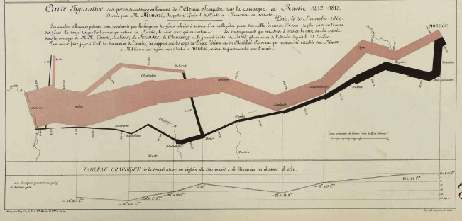

```{r setup, include=FALSE}
knitr::opts_chunk$set(echo = TRUE, fig.align='center')
```

```{r include=FALSE, message=FALSE}
library(tidyverse)
library(gridExtra)
library(gt)
library(random)
library(ggplot2)
```


# ¿Que es visualizar datos uy cual es el problema?

La visualización de datos tiene como objetivo facilitar la apreciación de datos y determinar si patrones. Naturalmente, no se necesita gráficos para entender ciertos ideas.  Por ejemplo si un estudiantes tiene 25 años un otro estudiante tiene 20 años. No hay que hacer un gráfico para entender que hay 5 años de diferencia entre uno y el otro. Se hace gráficos típicamente cuando hay muchos datos y entender los datos con valores numéricos o lista no es ayuda. 

Por ejemplo trata de explicar cual es la diferencia (si hay) en las dos listas siguientes. 


```{r echo=FALSE}


Edad_Salon_1=randomNumbers(100, min=20, max=27, col=1)

Edad_Salon_1=as.data.frame(Edad_Salon_1)

Edad_Salon_1=as.list(Edad_Salon_1)
Edad_Salon_1
```

****

```{r echo=FALSE}
Edad_Salon_2=randomNumbers(100, min=20, max=26, col=1)

Edad_Salon_2=as.data.frame(Edad_Salon_2)

Edad_Salon_2=as.list(Edad_Salon_2)
Edad_Salon_2
```

Probablemente no es evidente a primera vista cual es la diferencia.  


***
## Resumir la información en tablas

Una de las alternativas es resumir los datos en una tablas

```{r include=FALSE}
Edad_Salon_1$Seq=seq(1:100)
Edad_Salon_2$Seq=seq(1:100)

df=bind_rows(Edad_Salon_1, Edad_Salon_2)
df$Salon=rep(c("Salon_1","Salon_2"), each=100)
df

```


```{r include=FALSE}
as_tibble(df)
```

```{r}
df%>%
  select(V1, Salon)%>%
  group_by(Salon)%>%
  summarize(promedio=mean(V1), 
             mínimo=min(V1),
             máximo=max(V1))%>%
  gt()%>%
  tab_header(
    title = "Edad de los Estudiantes")
  
```
Lo que uno observa es que las dos listas tienen valores muy similares pero el máximo valor en cada lista es diferente. Si hay muchos valores en una lista típicamente los humanos no podemos entender estos patrones. Por consecuencia es importante buscar maneras de resumir los datos en algo más conciso. 

## Visualizar muchos datos

Una otra alternativa es visualizar los datos con un gráfico, en este caso se uso una **Boxplot** (Gráfico de caja).  

```{r}
ggplot(df, aes(y=V1, x=Salon))+
  geom_boxplot()+
  ylab("Edad de los estudiantes")
```

# Ejemplos históricos

## Ejemplo de la Campaña de Napoleon para invadir a Rusia
Esta sección no es exhaustiva y solamente para representar algunos ejemplos de gráficos y su desarrollo.  Charles Joseph Minard (1781-1870; Francia) es una de las personas que contribuyó en lo que se llama gráficas informativas (Information Graphics).  El es reconocido por haber sido muy inovador en el uso de greaficos para demostrar patrones.  El más famoso de este fue sobre la campaña de guerra de Napoleon para invadir a Rusia (1812-1813).       

En este mapa, vemos el movimiento de la campaña de Napoleon para invadir a Rusia. El movimiento representa la cantidad de hombres que comenzaron el camino hacia Rusia (la linea marón clara) hasta Moscú, el viaje de regreso (el color negro). El ancho de la barra representa la cantidad de hombres presente en el ejercicio militar. Cuando comenzaron (saliendo de Paris) eran más de 422,000 soldados, al llegar a Moscú ya era solamente 100,000 soldados. Cuando finalmente, al regresar a Paris, despues de invadir a Rusia, Napoleon tenia solamente 10,000 soldados con él.   

Nota el gráfico debajo, este representa la temperatura de regreso de Moscú, y miran como al bajar la temperatura más y más los soldados murieron. La mortandad en gran parte fue por no estar preparado para el frio.   

```{r echo=FALSE, out.width = '70%', fig.align='center'}

```

## Donde proviene la carne que consumen la gente de Paris

Un otro ejemplo de Minard es la siguiente gráfico que representa donde proviene la carne que la gente en Paris comen. El color negro representa carne vaca, el color verde es la ternera y el rojo es el cordero.  El uso "Pie Charts" para identificar la proporción de cada grupo y el tamaño del "Pie Chart"  para identificar la cantidad relativa con los otros departamentos (Organización política local).  

```{r echo=FALSE, out.width = '60%', fig.align='center'}
knitr::include_graphics("Graficos/Minard_Carne_Paris.png")
```

# Ejemplos de Gráficos horibles


## Errores típicos en la produccion de gráficos. 

## Gráficos en 3D

Uno de los error principal cuando se hace gráficos es concentrar se en la decoración del gráfico para dar una impresión grandiosa y no en pasar un mensaje a la audiencia. Algunos de los errores incluye

 * Dimensiones innecesarias como los gráficos 3D para enseñar el conteo.  Este es un caso que uno ve regularmente en muchos sitios, artículos científicos, revistas y periódicos y trabajos de estudiantes.  **NO** hay ninguna razón de añadir una otra dimensión en esta gráfica ya que no ayuda a entender los datos y hasta puede causar dificultad de entender cual son los valores reales que representa las barras.

 
```{r echo=FALSE, out.width = '50%', fig.align='center'}
knitr::include_graphics("Graficos/A3D.png")
```
 
 


## Errores de escala

Muchas veces la variable en "X" tiene intervalos que no corresponde a la escala de la variable. En el siguiente ejemplo tenemos un linea que representa la cantidad de casos de una enfermedad, y el eje de x el año de recolección de los datos.  Nota que la escala no es consistente, hay 15 años entre 1930 y 1945, y 45 años entre los dos últimos puntos. 


```{r echo=FALSE, out.width = '50%'}

x=c(1900, 1910, 1920, 1930, 1945, 1990)
y=c(110, 120, 140, 160, 200, 1000)
z=c("A","A","A","A","A","A")

df=tibble(x,y,z)


l1=ggplot(df, aes(as.factor(x),y,group = interaction(z,y)))+
  geom_point()+
  geom_path(group=1)+
  xlab("Años")+
  ylab("Números de casos")
```

En el siguiente gráfico se resuelve el problema dejando que la escala se ajuste a la cantidad de años.  


```{r echo=FALSE, out.width = '50%'}

x=c(1900, 1910, 1920, 1930, 1945, 1990)
y=c(110, 120, 140, 160, 200, 1000)

df=tibble(x,y,z)


l2=ggplot(df, aes(x,y))+
  geom_point()+
  geom_path(group=1)+
  xlab("Años")+
  ylab("Números de casos")

grid.arrange(l1,l2,ncol=1)
```

##  La cantidad de "ticks".

La cantidad de grupos en las escalas es frecuentamente un problema donde o hay demasiado o no suficiente.  Vemos aquí dos ejemplos de estos problemas. En el primero no se puede leer con facilidad la secuencia de los datos en la variable "x". En el segunda gráfico no se enseña tanta información


```{r include=FALSE}

y=rnorm(1000, 0,1)


x= seq(from = 0, to = 999, by = 1)
dfs=tibble(x, y)
number_ticks <- function(n) {function(limits) pretty(limits, n)}

a= ggplot(dfs, aes(x=x, y=y))+
  geom_point()+
  scale_x_continuous(breaks=number_ticks(50))+
  xlab("La secuencia de los valores")


b= ggplot(dfs, aes(x=x, y=y))+
  geom_point()+
  scale_x_continuous(breaks=number_ticks(10))+
  xlab("La secuencia de los valores")
```

```{r echo=FALSE}
grid.arrange(a,b,ncol=1)
```


## Probelma de escala, incluir el cero o no?


En muchas ocasiones la falta de incluir una escala adecuada en la variable dependiente (Y) resulta en que es difícil interpretar los resultados.  Aquí van a observar dos gráfica, donde en la primera da impresión que hay diferencias entre los grupos (por ejemplo el grupo "D" tiene valores más pequeño y en la segunda con los mismo datos no se observa esta diferencia. El único componente que cambio fue la escala.   


```{r include=FALSE}
set.seed(78687957)
x=LETTERS[seq( from = 1, to = 10 )]
x
y=runif(10, 80,100)
y

dfY=tibble(x,y)

b= ggplot(dfY, aes(x,y))+
  geom_count()+
  theme(legend.position = "none")


c= ggplot(dfY, aes(x,y))+
  geom_count()+
  expand_limits(y = c(0, 100))+
  theme(legend.position = "none")
```

```{r echo=FALSE}

grid.arrange(b,c, nrow=1)
```


## Construcción de Tablas:

Se menciona errores comunes cuando se prepara tablas

  1. Errores comunes en tablas es incluir exceso de valores significativos en diferentes formato en la misma columna.
  2. Los valores numéricos no están justificado a la derecha.
  3. Las escala de los valores no están mencionados.
  
  Aquí presento dos tablas una con los errores y la segunda son estos errores corregidos. 
  
  
### Tabla con errores 
  
|         | Tamaño de muestra | El largo de la hoja | valor de p  |
|---------|:-------|:--------:|:-------------|
| Especie 1 | 27273 |  11.03  | 0.000000001 |
| Especie 2 | 169019 | 13.5  | 0.098979676 |
| Especie  | 1.087^6 | 14.5  | .0300001 |

***

### Tabla con errores solucionados

|         | Tamaño de muestra | El largo de la hoja (cm) | valor de p  |
|:---------|-------:|--------:|-------------:|
| Mujeres | 27273 | 11.0  | <0.001 |
| Hombres | 169019 | 13.5 | 0.099 |
| Especie  | 1087669 | 14.5  | 0.030 |
